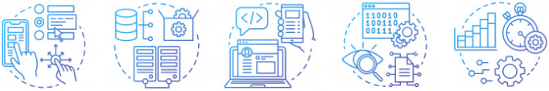

### Olá! 
### Seja bem vind@ ao meu portfólio! 👋😄

> Aqui você pode conhecer um pouco mais sobre mim.

`Atualmente estou em busca de um estágio como Desenvolvedor Web.` 

- 📚 Estou cursando [Análise e Desenvolvimento de Sistemas](https://www.ifpe.edu.br/campus/recife/cursos/superiores/tecnologos/analise-e-desenvolvimento-de-sistemas) no IFPE.

- 🎓 Sou formado nos técnicos de Telecomunicações ([IFPE](https://www.ifpe.edu.br/campus/recife/cursos/tecnicos/subsequente/telecomunicacoes)) e Manutenção e Suporte em Informática ([ETEPAM](http://www.etepam.pe.gov.br/cursos/presencial/manutencao-e-suporte-em-informatica)).

- 👨🏻‍💻 Estagiei como [Desenvolvedor Web](https://github.com/Gwolner/csmo-ambulatorial) por 2 anos no Departamento de Gestão de Tecnologia da Informação, dentro do IFPE.

- 🔬 Participei do programa PIBEX como aluno pesquisador em um [projeto de acessibilidade](https://github.com/Gwolner/pibex-hello-moodle) por navegação web através da voz.

- 🎯 Fui estagiário na [Embratel](https://www.embratel.com.br) por 6 meses, tendo o contrato renovado por mais 6 e, ao término, sendo efetivado como funcionário.

- 🍁 Aperfeiçoando minhas habilidades e conhecimento referentes a desenvolvimento web com as tecnologias HTML5, CSS3, JS, Java e PHP.

- 🌱 Aprendendo novas tecnologias referente ao mundo web: Typescript, NodeJS, React, React Native e WordPress.
